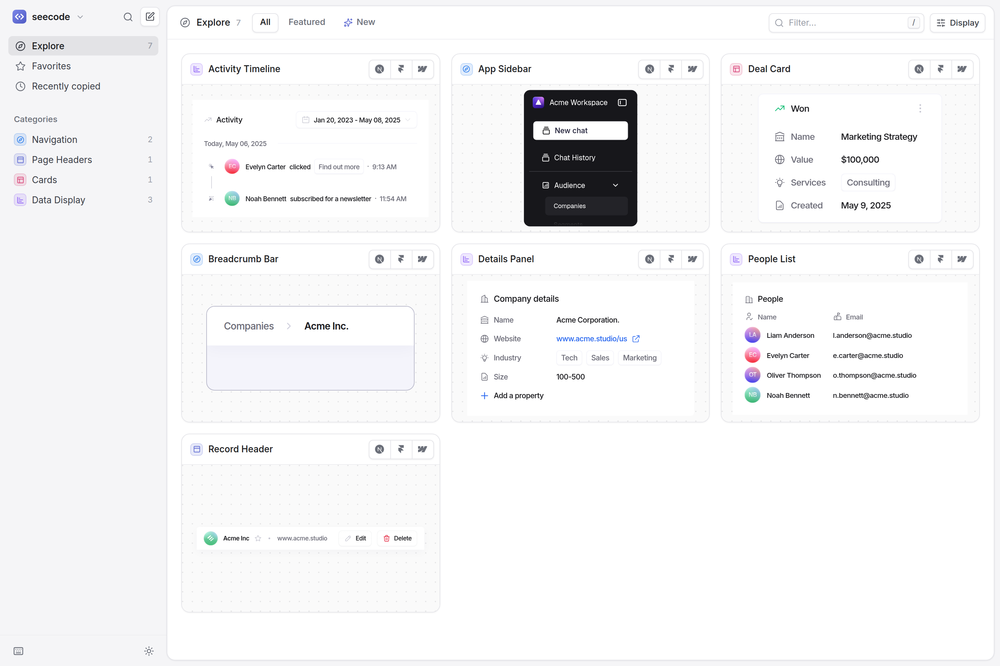

# seecode

A marketplace dashboard for copy-paste React components, styled after [Linear](https://linear.app)'s
interface in light mode. Browse live previews and copy any component's source in one click.

**Live site:** https://seecode-rho.vercel.app



## Features

- **One-click copy.** Every card and code block has a Copy button that puts the component's exact
  source on your clipboard (with a fallback for browsers that block the Clipboard API).
- **Live, interactive previews.** Each component renders in an isolated canvas — click it, type in
  it, hover it. What you see is the code you copy, because previews and code come from the same file.
- **Component pages** with a large preview, syntax-highlighted source and usage example, install
  steps, a props table, and a Linear-style properties panel.
- **Linear-style navigation.** An inset panel layout, a ⌘K command menu, grid and grouped list
  views, quick filters, favorites, a "Recently copied" history, right-click menus and toasts.
- **Keyboard first.** `⌘K` search, `/` filter, `j`/`k` to move, `c` to copy, `f` to favorite,
  `v` to switch views, `g` then `e`/`f`/`r` to jump around. Press `?` for the full list.
- **Responsive** down to phone widths, with a slide-out sidebar.

Favorites, copy history and view preferences are stored in the browser (`localStorage`); there is
no backend.

## Getting started

Requires Node.js 20.19+ or 22.12+.

```bash
npm install
npm run dev       # http://localhost:5173
```

| Script              | What it does                                                   |
| ------------------- | -------------------------------------------------------------- |
| `npm run dev`       | Start the dev server                                           |
| `npm run build`     | Type-check and build a static site into `dist/`                |
| `npm run preview`   | Serve the production build locally                             |
| `npm run typecheck` | Run TypeScript                                                 |
| `npm test`          | Unit tests, plus registry checks that server-render every demo |

## Adding a component

Components live in `src/registry/components/<slug>/` as three files — the component people copy,
a demo, and metadata. New folders are picked up automatically. See
[CONTRIBUTING.md](CONTRIBUTING.md) for the full guide; `npm test` validates every entry.

The sample components (and the authors credited on them) are placeholder content — replace them
with your own.

## Project structure

```
src/
├── registry/            # the catalogue
│   ├── components/      # one folder per component (auto-discovered)
│   ├── categories.ts    # sidebar categories
│   └── authors.ts       # creators shown on cards
├── pages/               # Explore / category / tag / favorites / recent, and the component page
├── components/          # dashboard UI: cards, rows, code block, command menu, dialogs…
├── lib/                 # routing, persisted state, clipboard, search, syntax highlighting
└── styles/index.css     # Tailwind v4 theme — the Linear-inspired light tokens
```

Built with React 19, TypeScript, Vite, Tailwind CSS v4, [cmdk](https://cmdk.paco.me),
[Radix UI](https://www.radix-ui.com), [Shiki](https://shiki.style) and
[Lucide](https://lucide.dev) icons. Inter and Geist Mono are self-hosted via Fontsource.

## Deploying

### Vercel

The repo includes a [`vercel.json`](vercel.json), so there is nothing to configure:

1. In Vercel, choose **Add New… → Project** and import `designmeops/seecode` from GitHub.
2. Leave the detected settings as they are (Vite, `npm run build`, output `dist`) and click
   **Deploy**.

Vercel deploys the repository's default branch to production and gives every other branch and
pull request its own preview URL. Hashed files in `/assets` are cached for a year; `index.html`
is always revalidated, so a new deploy shows up on the next page load.

### Anywhere else

`npm run build` produces a fully static site in `dist/`. It uses hash routes and relative asset
paths, so it works from any static host or sub-path (GitHub Pages, Netlify, S3) with no rewrite
rules.
