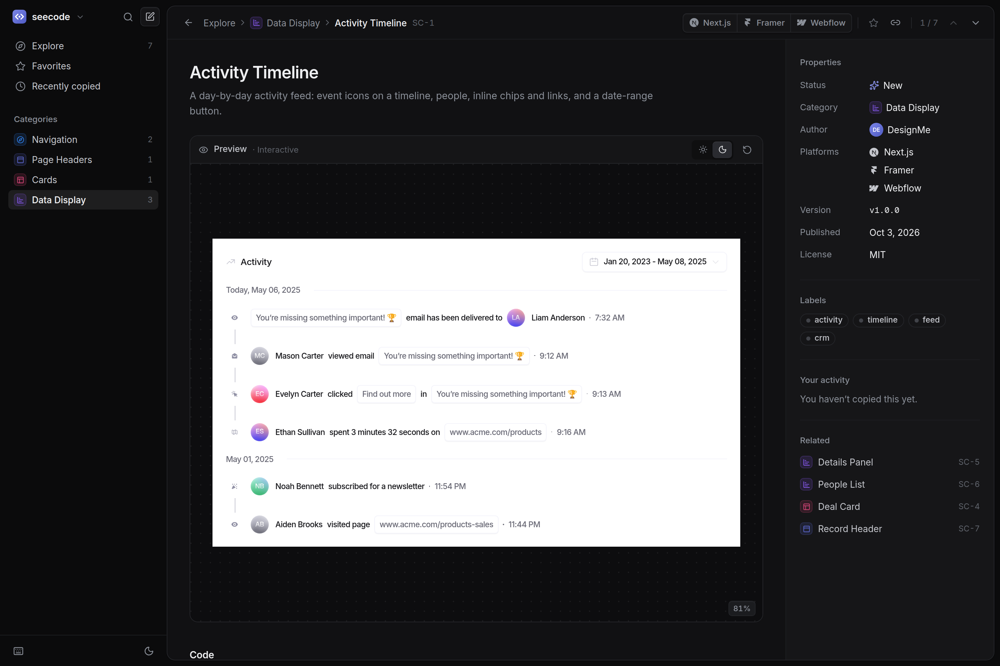

# seecode

A marketplace dashboard for UI components, styled after [Linear](https://linear.app)'s interface
in light and dark mode. Every component ships for **Next.js**, **Framer** and **Webflow** — browse
live previews and copy the code for your platform in one click.

**Live site:** https://seecode-rho.vercel.app




## Features

- **Copy for your platform.** Each card has a copy button per platform: Next.js (React + Tailwind
  CSS), Framer (a code component with property controls) and Webflow (an HTML + CSS embed). `c`
  copies the platform you used last.
- **Live, interactive previews.** Each component renders on its own canvas — click it, hover it.
  The Next.js preview and the copied code come from the same file. Wide demos zoom out to fit,
  like a design tool, and the canvas can be switched between light and dark.
- **Component pages** with platform tabs, syntax-highlighted code, step-by-step instructions for
  each platform, a props table and a Linear-style properties panel.
- **Light, dark or system theme**, modelled on Linear's palettes, including the code highlighting.
- **Linear-style layout.** One top bar per page holds the title, view tabs, filter and display
  options; an inset panel layout, ⌘K command menu, grid and grouped list views, favorites, a
  "Recently copied" history, right-click menus and toasts.
- **Keyboard first.** `⌘K` search, `/` filter, `j`/`k` to move, `c` to copy, `f` to favorite,
  `v` to switch views, `g` then `e`/`f`/`r` to jump around. Press `?` for the full list.
- **Responsive** down to phone widths, with a slide-out sidebar.

Favorites, copy history, the theme and view preferences are stored in the browser
(`localStorage`); there is no backend.

## Getting started

Requires Node.js 20.19+ or 22.12+.

```bash
npm install
npm run dev       # http://localhost:5173
```

| Script              | What it does                                             |
| ------------------- | -------------------------------------------------------- |
| `npm run dev`       | Start the dev server                                     |
| `npm run build`     | Type-check and build a static site into `dist/`          |
| `npm run preview`   | Serve the production build locally                       |
| `npm run typecheck` | Run TypeScript                                           |
| `npm test`          | Unit tests, plus registry checks for all three platforms |

## Adding a component

Components live in `src/registry/components/<slug>/`: the code for each platform
(`<slug>.tsx`, `<slug>.framer.tsx`, `<slug>.webflow.html`), a demo and metadata. New folders are
picked up automatically. See [CONTRIBUTING.md](CONTRIBUTING.md) for the full guide; `npm test`
validates every entry, renders every demo and Framer version, and checks the Webflow class names.

The current components are built from a Figma app design, with placeholder people and company
names.

## Project structure

```
src/
├── registry/            # the catalogue
│   ├── components/      # one folder per component (auto-discovered)
│   ├── categories.ts    # sidebar categories
│   └── authors.ts       # creators shown on cards
├── pages/               # Explore / category / tag / favorites / recent, and the component page
├── components/          # dashboard UI: cards, rows, code block, command menu, dialogs…
├── lib/                 # routing, theme, platforms, persisted state, clipboard, search, highlighting
└── styles/index.css     # Tailwind v4 theme — Linear-inspired light and dark tokens
```

Built with React 19, TypeScript, Vite, Tailwind CSS v4, [cmdk](https://cmdk.paco.me),
[Radix UI](https://www.radix-ui.com), [Shiki](https://shiki.style) and
[Lucide](https://lucide.dev) icons. Inter and Geist Mono are self-hosted via Fontsource.

## Deploying

### Vercel

The repo includes a [`vercel.json`](vercel.json), so there is nothing to configure:

1. In Vercel, choose **Add New… → Project** and import `designmeops/seecode` from GitHub.
2. Leave the detected settings as they are (Vite, `npm run build`, output `dist`) and click
   **Deploy**.

Vercel deploys the repository's default branch to production and gives every other branch and
pull request its own preview URL. Hashed files in `/assets` are cached for a year; `index.html`
is always revalidated, so a new deploy shows up on the next page load.

### Anywhere else

`npm run build` produces a fully static site in `dist/`. It uses hash routes and relative asset
paths, so it works from any static host or sub-path (GitHub Pages, Netlify, S3) with no rewrite
rules.
